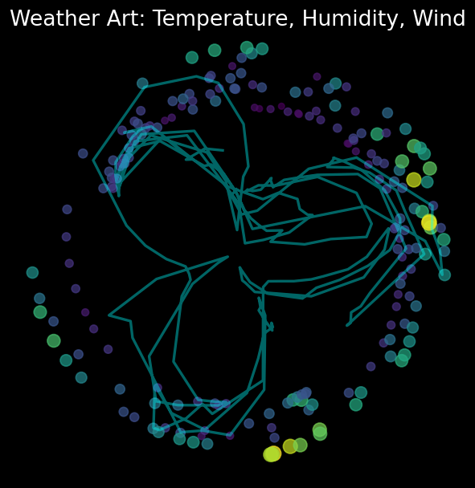

# Artistic Weather Visualization

## Project Overview
This project automatically fetches recent weather data for a specified city using Python, and transforms features such as temperature, humidity, and wind speed into an artistic polar coordinate visualization. The result is both a reflection of natural data changes and an abstract artwork.

## Tech Stack
- Python
- pandas / numpy
- matplotlib
- requests

## Quick Start

1. Install dependencies
   ```bash
   pip install -r requirements.txt
   ```

2. Run the main script
   ```bash
   python weather_art.py
   ```

3. The output image `weather_art.png` will be generated and the visualization will pop up automatically.

## Data Source
Weather data is collected from [Open-Meteo](https://open-meteo.com/), which is free and does not require an API key.

## Artistic Concept
- Temperature controls the radius in polar coordinates
- Humidity influences the angular transformation
- Wind speed determines the color and size of the points
- The curve blends data changes, and the overall color theme follows wind speed

## Example Output



## Customizing the City
You can modify the `latitude` and `longitude` variables in `weather_art.py` to visualize weather data from different cities.
